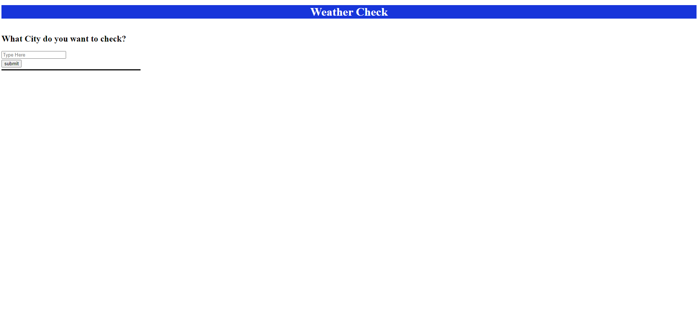
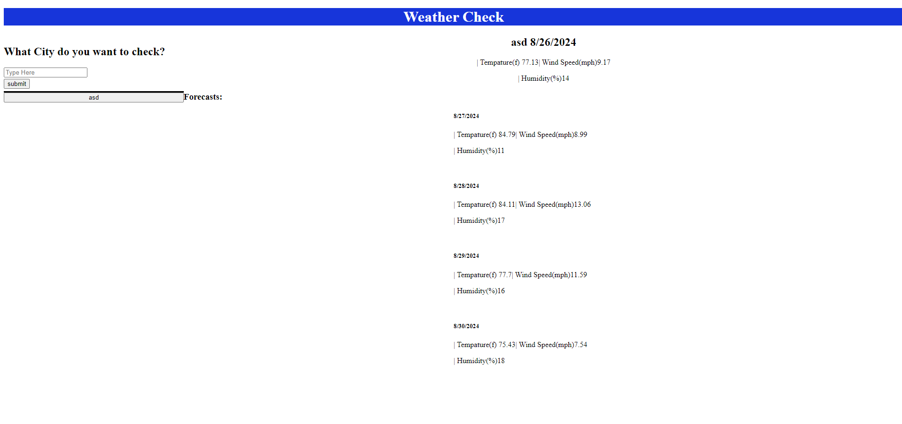

# Weather-Check
The weather checker allows for the user to check the weather for the next 4 days where ever you want to check

## Installation

In order to install, either zip install it and unzip it or follow this links instruction:

https://docs.github.com/en/get-started/start-your-journey/downloading-files-from-github

## Description
This allows you to type the name of a city and see the weather there for the next four days

## Visuals

## Link

https://ethan-verellen.github.io/Weather-Check/

## License

[MIT](https://choosealicense.com/licenses/mit/)